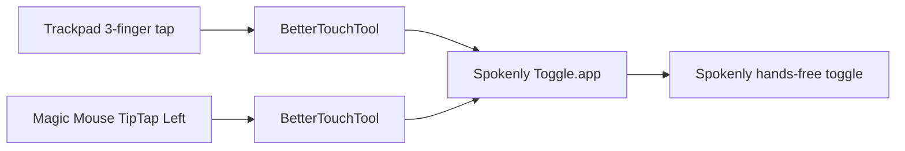

# Wispr Flow Input Profile

Last audited against the live configuration: 2026-08-01

## Profile Summary

| Field | Value |
| --- | --- |
| Provider ID accepted by `trx` | `wispr` or `wispr-flow` |
| Application | Wispr Flow |
| Main application bundle ID | `com.electron.wispr-flow` |
| Nested accessibility helper bundle ID | `com.electron.wispr-flow.accessibility-mac-app` |
| Logical action currently customized | `hands_free_toggle` |
| Wispr action | `popo` |
| Custom Wispr shortcut | Right Option, macOS key code `61` |
| Wispr built-in hands-free shortcut replaced by it | `Fn+Space` |

Right Option is the only active Wispr shortcut created specifically for this
setup. The other active Wispr shortcuts are built-in defaults stored in the
same effective preference map.

## Current Input Pipeline

The trackpad, Magic Mouse, and MX Master are currently assigned to
Spokenly-specific helper routes. All three must be switched back to Right
Option before they can control Wispr again. Wispr retains the final Right
Option to `popo` mapping.

## Custom Device Mappings

### MacBook trackpad

| Field | Value |
| --- | --- |
| Physical input | 3-finger tap |
| Owner | BetterTouchTool |
| BTT trigger type | `104` |
| BTT UUID | `CA4B9E78-76FB-4764-9301-A9937EE84D12` |
| Current output | Opens `Spokenly Toggle.app`, which calls `spokenly://toggle` |
| Wispr receives | Nothing from this current provider-specific route |
| Result | Currently controls Spokenly, not Wispr |
| Classification | Custom |

When switching back to Wispr Flow, this BTT trigger must be restored to Right
Option, key code `61`.

Other trackpad gestures are provider-independent and remain documented in the
[BetterTouchTool guide](../../btt/README.md) and
[quick shortcut reference](../../shortcut-reference.md).

### MX Master 3S

| Field | Value |
| --- | --- |
| Physical input | Auxiliary/thumb-style button |
| Logitech slot | `mx-master-3s-2b034_c195` |
| Logitech output | Smart Action `Spokenly Hands-Free` in every current Logitech profile |
| Smart Action result | Opens `Spokenly Toggle.app`, which calls `spokenly://toggle` |
| Wispr receives | Nothing from this current provider-specific route |
| Result | Currently controls Spokenly, not Wispr |
| Classification | Custom |

The mapping is assigned directly in every profile listed by the live Logitech
database, including Desktop/default, Codex, Ghostty, browsers, Claude, Warp,
and Sioyek. When switching back to Wispr, all of those profiles are reassigned
to Right Option. `trx` discovers the profile list dynamically.

### Magic Mouse

| Field | Value |
| --- | --- |
| Physical input | TipTap Left, 1 Finger Fix |
| Owner | BetterTouchTool |
| BTT trigger type | `16` |
| BTT UUID | `497F16E1-1725-4D6E-BD16-B8F88259EF2F` |
| Current output | Opens `Spokenly Toggle.app`, which calls `spokenly://toggle` |
| Wispr receives | Nothing from this current provider-specific route |
| Result | Currently controls Spokenly, not Wispr |
| Classification | Custom |

When switching back to Wispr Flow, this BTT trigger must be restored to Right
Option, key code `61`.

Other Magic Mouse gestures are provider-independent and remain documented in
the [BetterTouchTool guide](../../btt/README.md) and
[quick shortcut reference](../../shortcut-reference.md).

## Wispr Shortcuts, Classified Correctly

Wispr stores both built-in defaults and custom entries under
`prefs.user.shortcuts`. Presence in that object does not establish that a
shortcut was created by this setup.

| Input | Wispr code | Action | Classification |
| --- | --- | --- | --- |
| Escape | `53` | Dismiss Wispr | Built-in default |
| Right Option | `61` | Start or stop hands-free dictation, `popo` | Custom, replaces the built-in `Fn+Space` binding |
| Fn | `63` | Push-to-talk, `ptt` | Built-in default |
| `Ctrl+Fn` | `59+63` | Open Wispr Lens | Built-in default |
| `Cmd+Ctrl+C` | `55+59+8` | Copy the last dictated text | Built-in default |
| `Cmd+Ctrl+V` | `55+59+9` | Paste the last dictated text | Built-in default |
| `Fn+Space` | Not present in the current map | Start or stop hands-free dictation | Built-in default replaced by Right Option |

## Removed Wispr Experiments

| Former input | Former code | Former action | Status |
| --- | --- | --- | --- |
| Physical middle click | `4098` | Press Enter, `enter_rebind` | Removed because it broke normal browser middle-click behavior |
| Mouse button 4 | `4099` | Hands-free, `popo` | Removed on 2026-07-31; obsolete raw side-button fallback |
| Mouse button 5 | `4100` | Hands-free, `popo` | Removed on 2026-07-31; obsolete raw side-button fallback |
| Raw auxiliary button | `65535` | Hands-free, `popo` | Removed after routing the Logitech button to Right Option |
| Logitech F20 through BTT | `F20` | BTT emitted Right Option | Removed on 2026-08-01; BTT did not receive Logitech's generated F20 |

The Karabiner configuration still contains a Mouse button 4 to `Ctrl+Z` rule
labelled for Wispr Flow. It is not a current Wispr shortcut and should not be
treated as part of this provider profile.

## `trx` Switch Contract

The `trx` switcher preserves the three physical inputs and prevents both
providers from reacting to Right Option at the same time.

| Component | Wispr Flow value | Current Wispr/Spokenly switch | General future provider |
| --- | --- | --- | --- |
| Trackpad BTT trigger | Send Right Option | Switch between Right Option for Wispr and `Spokenly Toggle.app` for Spokenly | Change the BTT action for each provider |
| MX Master `c195` | Send Right Option directly in every Logitech profile | Switch between Right Option for Wispr and the `Spokenly Hands-Free` Smart Action | Change the Logitech output or Smart Action reference for each provider |
| Magic Mouse BTT trigger | Send Right Option | Switch between Right Option for Wispr and `Spokenly Toggle.app` for Spokenly | Change the BTT action for each provider |
| Wispr preference | Right Option maps to `popo` | Leave unchanged and quit Wispr when another provider is selected | Normally leave intact so returning to Wispr is predictable |

The switcher does not change Escape, Fn, Lens, copy-last-text, or
paste-last-text. Those are Wispr defaults, not device-adapter settings.

Run `trx wispr` to activate this profile, `trx status` to inspect every mapping,
and `trx verify` to check mappings, process exclusivity, and Logitech database
integrity. The MX Master mapping covers every profile listed by the live
Logitech database.

## Sources Of Truth

| System | Live source |
| --- | --- |
| Wispr Flow | `~/Library/Application Support/Wispr Flow/config.json`, especially `prefs.user.shortcuts` |
| Logitech Options+ | `~/Library/Application Support/LogiOptionsPlus/settings.db` |
| BetterTouchTool | Current `btt_data_store.version_*` under `~/Library/Application Support/BetterTouchTool/` |
| Tracked Karabiner config | `mac/.config/karabiner/karabiner.json` |
| Provider switch command | `mac/.local/bin/trx` |

Detailed implementation and troubleshooting remain in:

- [Logitech Options+ and Wispr Flow setup](../../logitech-options-wispr-flow.md)
- [BetterTouchTool gesture setup](../../btt/README.md)
- [Custom shortcut quick reference](../../shortcut-reference.md)

## Verification

After changing this profile or the switch implementation:

1. Run `trx wispr`, `trx status`, and `trx verify`.
2. Inspect `prefs.user.shortcuts` and distinguish defaults from custom entries.
3. Test the trackpad 3-finger tap.
4. Test the MX Master auxiliary/thumb button in each intended Logitech profile.
5. Test Magic Mouse TipTap Left.
6. Confirm browser middle click, Back, and Forward still behave normally.
7. Run `trx spokenly` when finished if Spokenly should remain the active
   provider.
